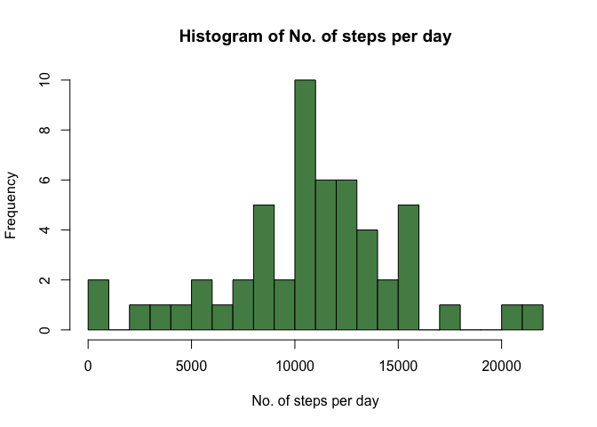
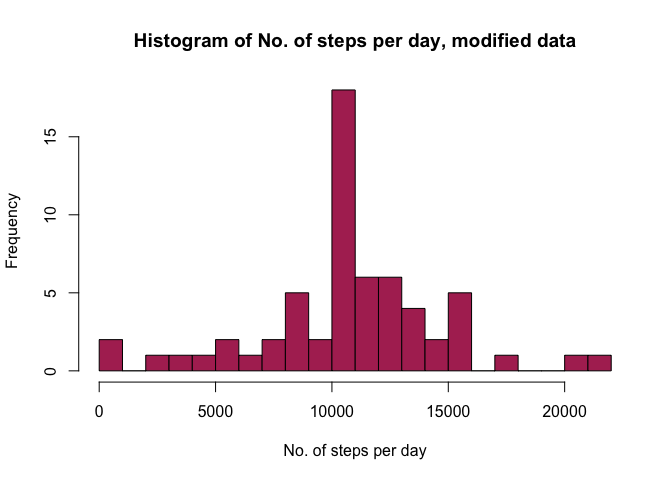
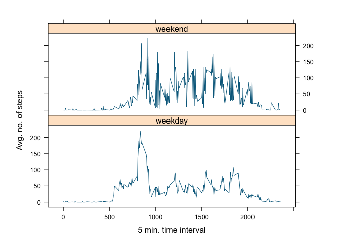

Loading and preprocessing the data
----------------------------------

    setwd("/Users/Andreas/Desktop/Data Science/Reproducible Research")
    getwd()

    ## [1] "/Users/Andreas/Desktop/Data Science/Reproducible Research"

    dat<-read.csv("activity.csv",header=T)

### What is mean total number of steps taken per day?

    steps<-aggregate(steps~date,dat,sum)
    hist(steps$steps,xlab="No. of steps per day",main=paste("Histogram of No. of steps per day"),breaks=20,col="palegreen4")

<!-- -->

    meansteps<-mean(steps$steps,na.rm=T)
    mediansteps<-median(steps$steps,na.rm=T)

The `mean` is 1.076618910^{4} while the `median` is 10765

What is the average daily activity pattern?
-------------------------------------------

    stepinterval<-aggregate(steps~interval,dat,mean,na.rm=T)
    plot(stepinterval$interval,stepinterval$steps,type="l",xlab="Interval",ylab="Mean no. of steps",main=paste("Plot showing the mean no. of steps per 5 min. interval"),col="midnightblue")

<!-- -->

    which.max(stepinterval$steps)

    ## [1] 104

    stepinterval[104,]

    ##     interval    steps
    ## 104      835 206.1698

On average, the interval containing the most steps is 835 with
206.1698113 steps.

Imputing missing values
-----------------------

### 1. Calculate and report the total number of missing values in the dataset (i.e. the total number of rows with 𝙽𝙰s)

     comc<-!complete.cases(dat)
    sum(comc==TRUE)

    ## [1] 2304

### 2. Devise a strategy for filling in all of the missing values in the dataset. The strategy does not need to be sophisticated. For example, you could use the mean/median for that day, or the mean for that 5-minute interval, etc.

I choose to use tapply yo finde the mean no. of steps for a given
interval and inserting them into the noncomplete cases in a new data
frame.

### 3.Create a new dataset that is equal to the original dataset but with the missing data filled in.

    datc<-dat
    avg_int<-with(dat,tapply(steps,interval,data=dat,mean,na.rm=T))
    datc$steps[comc]<-avg_int[as.character(datc$interval[comc])]
    sum(is.na(comc))

    ## [1] 0

### 4.Make a histogram of the total number of steps taken each day and Calculate and report the mean and median total number of steps taken per day. Do these values differ from the estimates from the first part of the assignment? What is the impact of imputing missing data on the estimates of the total daily number of steps?

    steps<-aggregate(steps~date,datc,sum)
    hist(steps$steps,xlab="No. of steps per day",main=paste("Histogram of No. of steps per day, modified data"),breaks=20,col="maroon")

<!-- -->

    meansteps<-mean(steps$steps,na.rm=T)
    mediansteps<-median(steps$steps,na.rm=T)

The new `mean` is 1.076618910^{4} and the new `median` is
1.076618910^{4}. The mean remains the same and the median has only
changed slightly with our approch, however this would be sensible to
which approch was choosen to replace the NAs.

Are there differences in activity patterns between weekdays and weekends?
-------------------------------------------------------------------------

### 1. Create a new factor variable in the dataset with two levels – “weekday” and “weekend” indicating whether a given date is a weekday or weekend day.

    datc$date<-as.Date(datc$date)
    datc$dayname<-weekdays(datc$date)
    weekend<-c("Saturday","Sunday")
    datc$daytype <- as.factor(ifelse(datc$dayname == weekend, "weekend", "weekday"))

### 2. Make a panel plot containing a time series plot (i.e. 𝚝𝚢𝚙𝚎 = "𝚕") of the 5-minute interval (x-axis) and the average number of steps taken, averaged across all weekday days or weekend days (y-axis). See the README file in the GitHub repository to see an example of what this plot should look like using simulated data.

    library(lattice)
    daytypeplot<-aggregate(steps~interval+daytype,datc,mean)
    s<-xyplot(steps~interval|factor(daytype),data=daytypeplot,aspect=1/3,type="l",col="deepskyblue4",xlab="5 min. time interval",ylab="Avg. no. of steps")
    print(s)

<!-- -->
